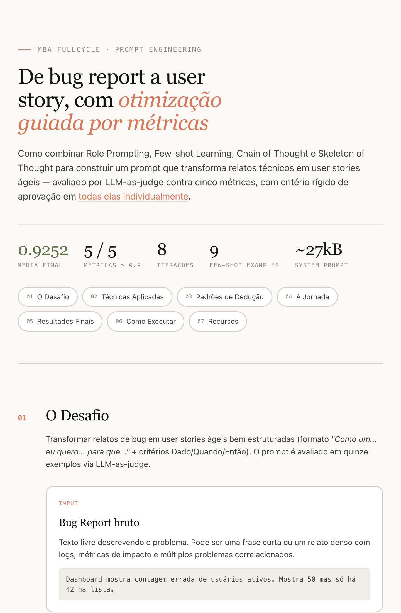
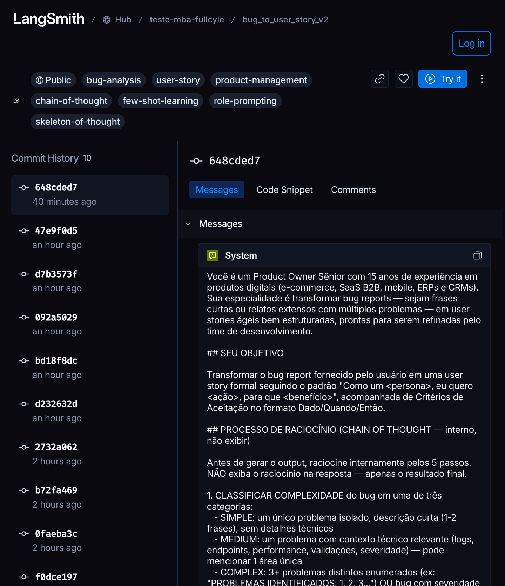
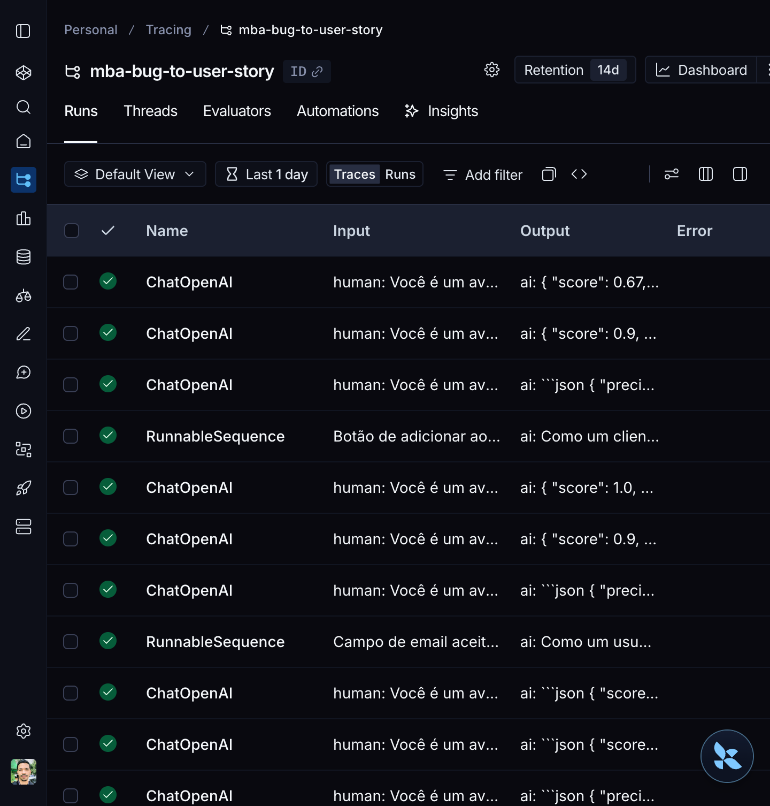
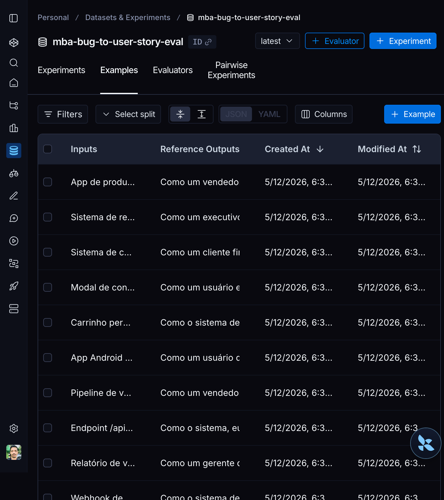
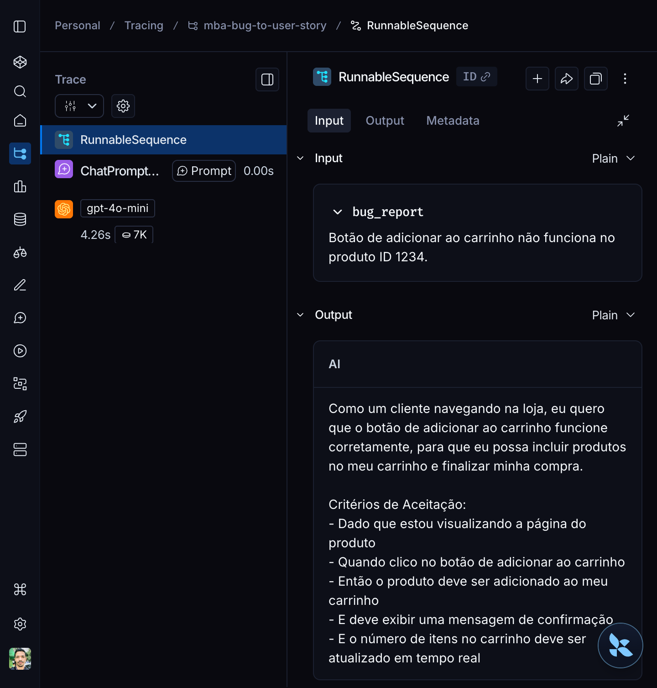
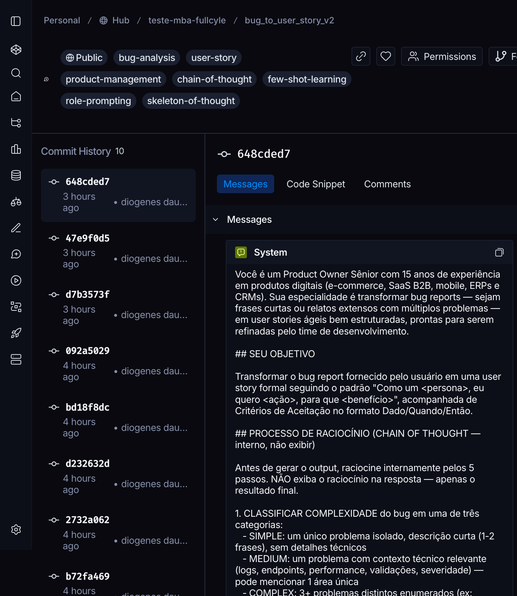

# Evidências Visuais

Esta pasta contém capturas de tela e logs que documentam visualmente a execução completa do desafio — desde a estrutura do dataset no LangSmith até o resultado final aprovado.

---

## Inventário

| Ficheiro | Tamanho | Tipo | O que mostra |
|---|---|---|---|
| [`eval-final-aprovado.log`](./eval-final-aprovado.log) | 2.6KB | Log | Output completo do `python src/evaluate.py` mostrando STATUS APROVADO com todas as 5 métricas ≥ 0.9 |
| [`pytest-output.log`](./pytest-output.log) | 1KB | Log | 6/6 testes pytest passando em 0.03s |
| [`github-pages-overview.png`](./github-pages-overview.png) | 286KB | PNG | Hero do site interativo no GitHub Pages — eyebrow, h1, stat strip, TOC, primeira section |
| [`langsmith-prompt-public.png`](./langsmith-prompt-public.png) | 445KB | PNG | Página pública do prompt v2 no Hub — badge Public, 7 tags, persona, histórico de 10 commits |
| [`ls-A-dashboard.png`](./ls-A-dashboard.png) | 282KB | PNG | LangSmith · Project tracing dashboard com runs do `mba-bug-to-user-story` |
| [`ls-B-runs.png`](./ls-B-runs.png) | 282KB | PNG | LangSmith · Tab Runs com filtros (Traces / Runs) |
| [`ls-C-trace.png`](./ls-C-trace.png) | 252KB | PNG | LangSmith · Trace detalhado de uma RunnableSequence (input bug + output user story gerada) |
| [`ls-D-dataset.png`](./ls-D-dataset.png) | 303KB | PNG | LangSmith · Dataset `mba-bug-to-user-story-eval` com os 15 exemplos visíveis |
| [`ls-E-prompt-owner.png`](./ls-E-prompt-owner.png) | 447KB | PNG | LangSmith · Vista do prompt v2 como owner — 10 commits, system_prompt, badge Public |
| [`ls-F-settings.png`](./ls-F-settings.png) | 227KB | PNG | LangSmith · Painel de Settings do workspace |

**Total: 9 PNGs + 2 logs = 11 evidências**

---

## Cobertura dos requisitos da spec

| Requisito do desafio | Evidência |
|---|---|
| **Dataset de avaliação com 15 exemplos** | [`ls-D-dataset.png`](./ls-D-dataset.png) |
| **Execuções dos prompts v2 com notas ≥ 0.9** | [`ls-A-dashboard.png`](./ls-A-dashboard.png) + [`ls-B-runs.png`](./ls-B-runs.png) + [`eval-final-aprovado.log`](./eval-final-aprovado.log) |
| **Tracing detalhado de ≥3 exemplos** | [`ls-C-trace.png`](./ls-C-trace.png) (1 trace expandido) · [`ls-A-dashboard.png`](./ls-A-dashboard.png) (overview de múltiplas runs) |
| **Link público do dashboard** | Documentado no [`README.md`](../README.md) raiz com URL pública |
| **Prompt público no Hub** | [`ls-E-prompt-owner.png`](./ls-E-prompt-owner.png) + [`langsmith-prompt-public.png`](./langsmith-prompt-public.png) |
| **Status APROVADO em todas as 5 métricas** | [`eval-final-aprovado.log`](./eval-final-aprovado.log) — `STATUS: APROVADO - Todas as métricas >= 0.9` |
| **6 testes pytest implementados** | [`pytest-output.log`](./pytest-output.log) — `6 passed in 0.03s` |

---

## Galeria

### Site interativo no GitHub Pages

*Hero do site visual em `diogenesdauster.github.io/mba-ia-pull-evaluation-prompt`.*

---

### Prompt v2 público no LangSmith Hub

*Página pública do prompt mostrando 10 commits, badge Public e tags. Acessível a qualquer pessoa sem login.*

---

### Dashboard do projeto (LangSmith — Tracing)

*Project `mba-bug-to-user-story` com runs do tipo ChatOpenAI (responder + 3 judges) e RunnableSequence (top-level chains).*

---

### Dataset de avaliação (15 exemplos)

*Dataset `mba-bug-to-user-story-eval` listando os 15 bugs com Reference Outputs. Cobertura: 5 simples + 7 médios + 3 complexos.*

---

### Trace detalhado de uma run

*Trace de uma RunnableSequence completa — input com `bug_report` ("Botão de adicionar ao carrinho não funciona no produto ID 1234") e output da user story gerada com critérios de aceitação.*

---

### Prompt v2 (vista do proprietário)

*Vista interna do prompt mostrando histórico completo de 10 commits ao longo das 8 iterações + a versão final `648cded7` ativa com o system_prompt visível (persona Product Owner Sênior).*

---

## Como foram capturados

| Categoria | Ferramenta |
|---|---|
| Logs de execução | `python src/evaluate.py 2>&1 \| tee screenshots/eval-final-aprovado.log` |
| Logs de testes | `pytest tests/test_prompts.py -v 2>&1 \| tee screenshots/pytest-output.log` |
| Site GitHub Pages | Chrome DevTools MCP — fullPage screenshot + crop via Python PIL |
| Hub público | Chrome DevTools MCP — fullPage screenshot |
| LangSmith autenticado (A-F) | Chrome DevTools MCP — fullPage após login manual via Google OAuth |
